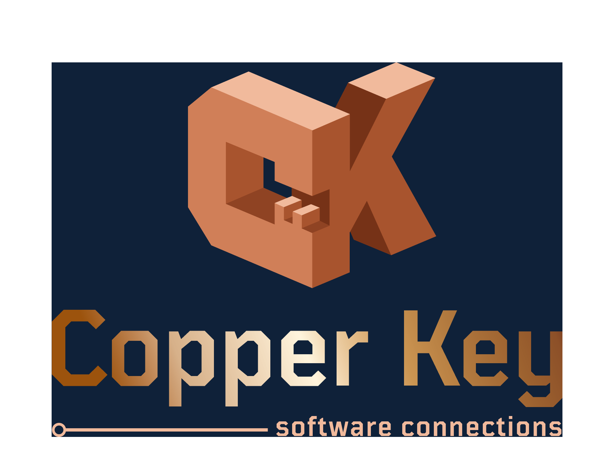

# 

 

<link rel="stylesheet" href="styles/buttons.css">
<!--Start of Housecallpro Online booking button--> 
<button id="myButton" 
		data-token="2ea1500f721d4fc392da5b636ab185e9" 
		data-orgname="Copper-Key-Software-Connections" 
		class="hcp-button"
		onClick="HCPWidget.openModal()"
		style="width:auto; font-size:x-large"> 
Book online 
</button> 
<!--End of Housecallpro Online booking button-->
 
(through HouseCall Pro)

 

or continue reading below

<!--  -->

